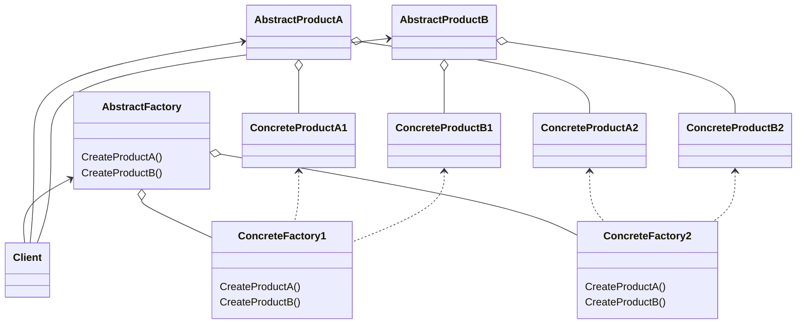

Abstract Factoryパターンは、オブジェクトの生成に注目したパターンで、関連するオブジェクトをその具体的なクラスを意識させないで生成することを目的としています。
> 互いに関連したり依存し合うオブジェクト群を、その具象クラスを明確にせずに生成するためのインターフェースを提供する

```mermaid
classDiagram

class AbstractFactory {
    CreateProductA()
    CreateProductB()
}

class ConcreteFactory1 {
    CreateProductA()
    CreateProductB()
}

class ConcreteFactory2 {
    CreateProductA()
    CreateProductB()
}

class Client { }
class AbstractProductA { }
class ConcreteProductA1 { }
class ConcreteProductA2 { }
class AbstractProductB { }
class ConcreteProductB1 { }
class ConcreteProductB2 { }

AbstractFactory o-- ConcreteFactory1
AbstractFactory o-- ConcreteFactory2
AbstractFactory <-- Client

ConcreteProductA1 <.. ConcreteFactory1
ConcreteProductB1 <.. ConcreteFactory1
ConcreteProductA2 <.. ConcreteFactory2
ConcreteProductB2 <.. ConcreteFactory2

AbstractProductA <-- Client
AbstractProductA o-- ConcreteProductA1
AbstractProductA o-- ConcreteProductA2

AbstractProductB <-- Client
AbstractProductB o-- ConcreteProductB1
AbstractProductB o-- ConcreteProductB2

```