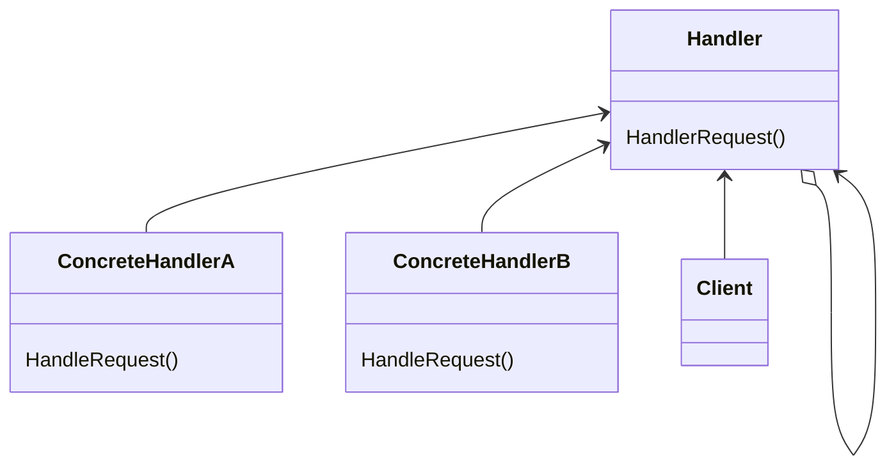

Chain of Responsibilityパターンはオブジェクトの振る舞いに注目したパターンで、 「処理を依頼する側」と「実際に処理を行う側」を分離することを目的としています。
> １つ以上のオブジェクトに要求を処理する機会を与えることにより、
> 要求を送信するオブジェクトと受信するオブジェクトの結合を避ける。
> 受信する複数のオブジェクトをチェーン状につなぎ、あるオブジェクトがその要求を処理するまで、
> そのチェーンに沿って要求を渡していく。

