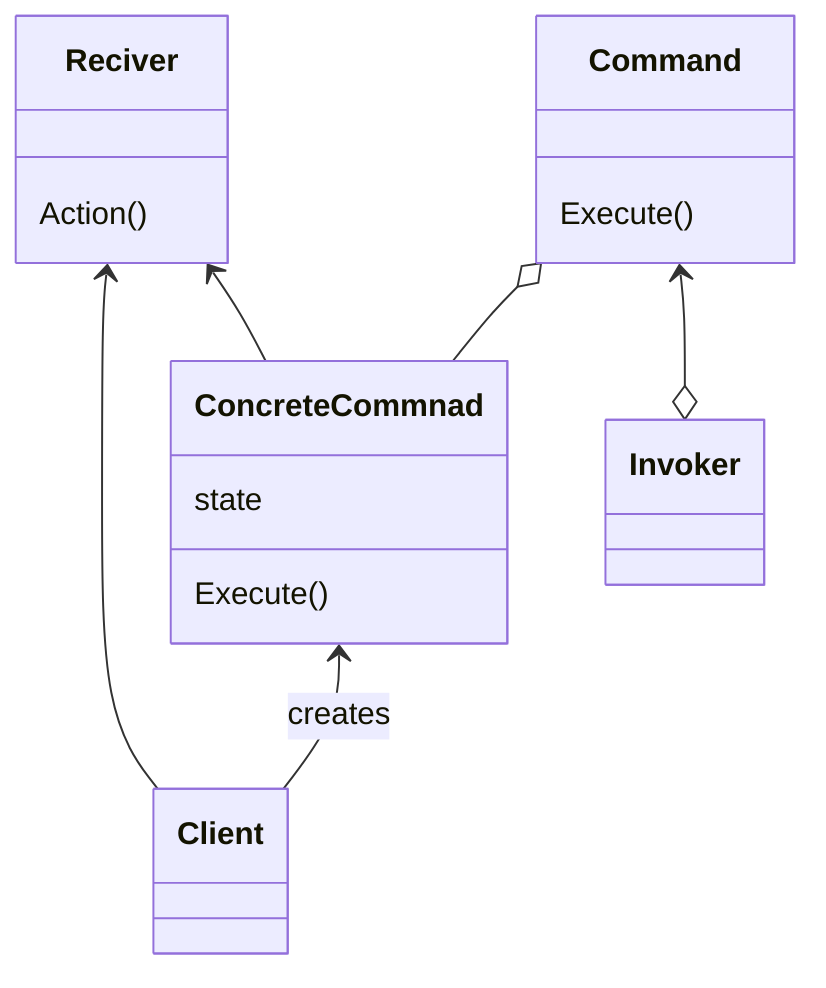

Commandパターンはオブジェクトの振る舞いに注目したパターンで、「要求」そのものをクラスとして表し、
「要求を送る側」と「要求を受け取る側」を分離することを目的としています。
> 要求をオブジェクトとしてカプセル化することによって、様々な要求または要求からなるキューやログによりクライアントをパラメータ化する。
> そして、取り消し可能な操作をサポートする。

#### メリット
- 既存のコードを修正することなく機能拡張できる
- クラスの再利用性を向上させる
- 処理のキューイング
- UndoやRedoのサポート

