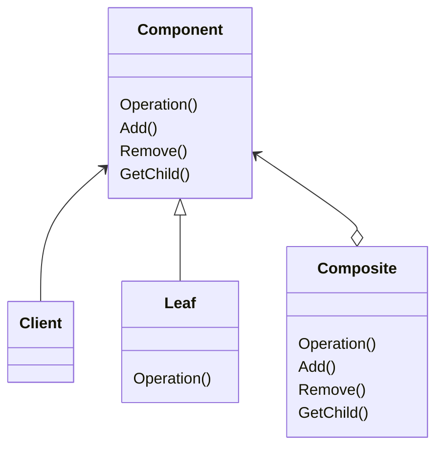

Compositeパターンはオブジェクトの構造に注目したパターンで、単体のオブジェクトとオブジェクトの集合を同一視することを目的としています。
> 部分-全体階層を表現するために、オブジェクトを木構造に組み立てる。Compositeパターンにより、クライアントは、個々のオブジェクトとオブジェクトをこうせいたものを一様に扱うことができ流ようになる。

### メリット
- クライアント側の操作が簡単になる
- 新しい枝を簡単に追加できる

