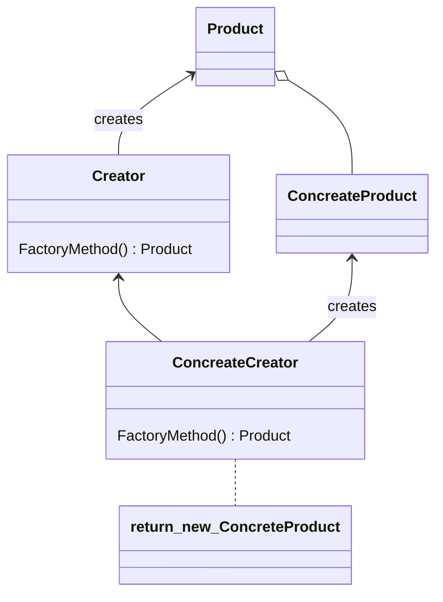
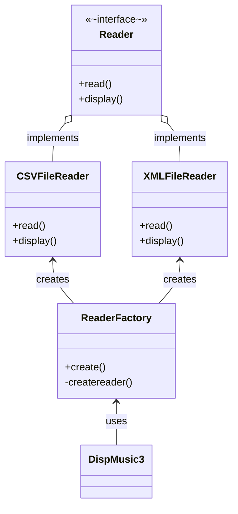

Factory Methodパターンはオブジェクトの生成方法に注目したパターンで、オブジェクトを生成するためのAPIを定義し、クラスの敬承を使って生成されるオブジェクトを切り替えルことを目的としています。
> オブジェクトを生成するときのインターフェースだけを規定して、実際にどのクラスをインスタンス化するかはサブクラスが決めるようにする。
> Factory Methodパターンは、インタスタンス化をサブクラスに任せる。

### メリット
オブジェクトの生成処理と使用処理を分離できる
オブジェクトの利用側とオブジェクトのクラスの結びつきを低くする

### クラス図

