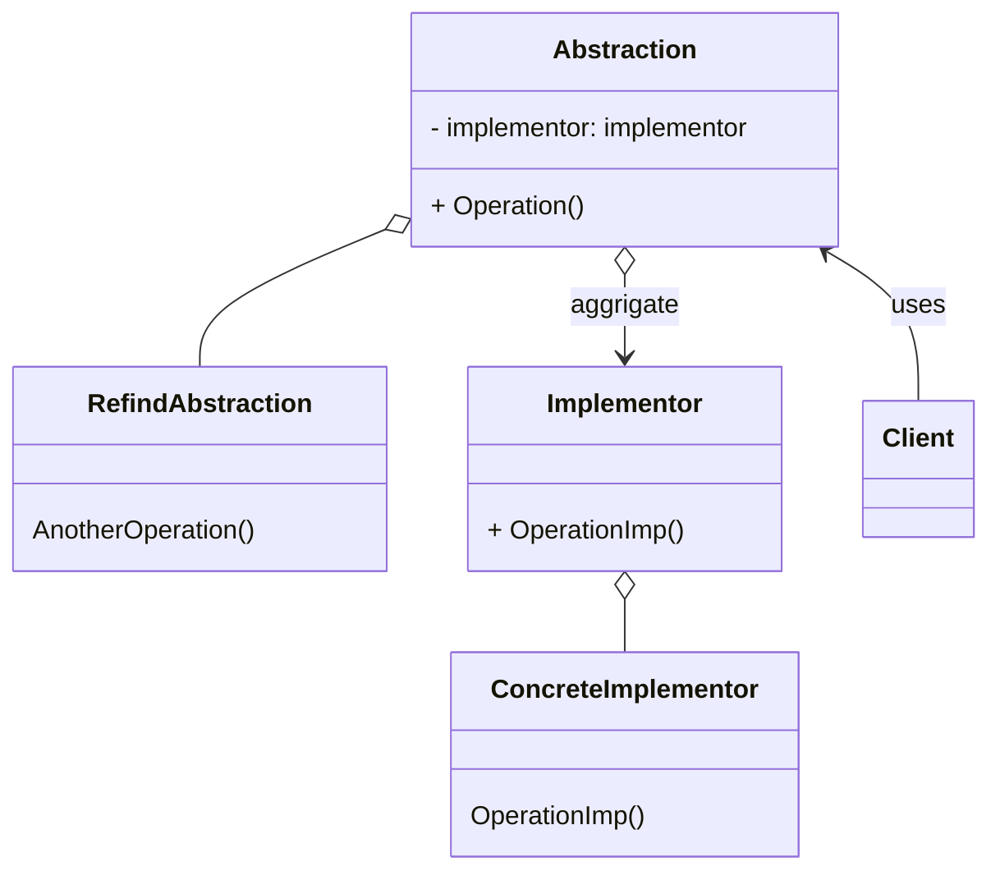

Bridgeパターンはオブジェクトの構造に注目したパターンで、「機能を提供するクラス群」と「実装を提供するクラス群」を分けることを目的としています。
> 抽出されたクラスと実装を分離して、それらを独立に変更できるようにする。

「ポリモーフィズム」、「委譲」を活用したパターン

### メリット
- クラス階層の見通しがよくなる
  - 「機能」と「実装」を提供するクラス群が分けられているので、クラス階層を理解しやすくなる
- 最終的に作成するべきクラス数を抑えることができる
  - 参考例：機能の種類が4つ、実装の種類が３つ
    - 通常　親クラス：１ + サブクラス：12(4x3) = 13
    - Bridg　親クラス：２ + サブクラス：7(4+3) = 9
- 機能の拡張と実装の切り替えが容易

