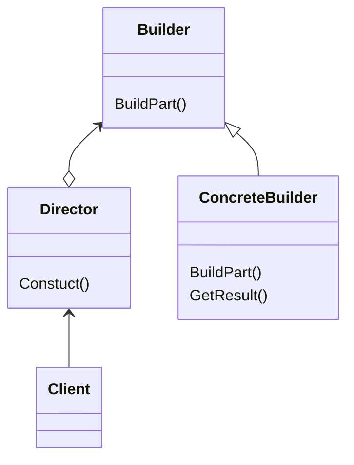

Builderパターンは、オブジェクトの生成に注目したパターンで、
オブジェクトの「生成手順」、「生成手段」を分離することを目的としています。
> 複合オブジェクトについて、その作成過程を表現形式に依存しないものにすることにより、同じ作成過程で異なる表現形式のオブジェクトを生成できるようにする

#### メリット
- Productオブジェクトの生成過程や生成手段を隠すことができる
- オブジェクトの生成過程や生成手段のコードを局所化できる

