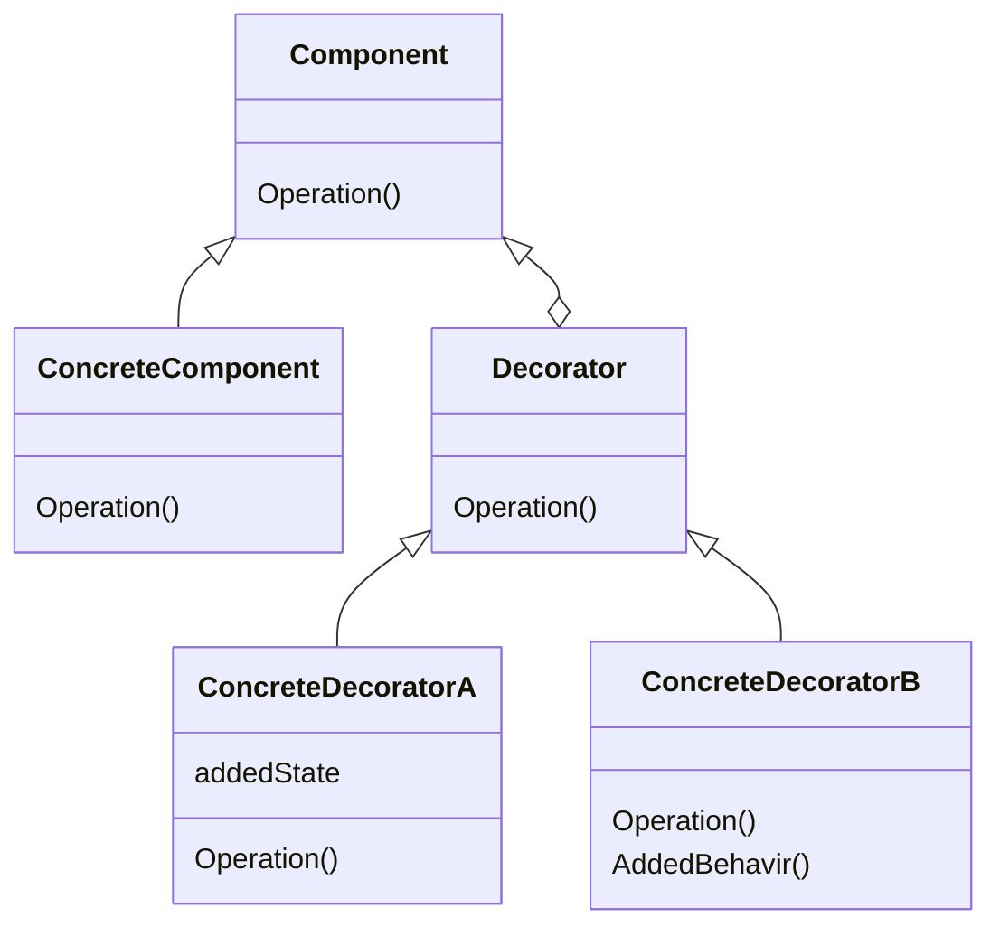

Decoratorパターンはオブジェクト構造に注目したパターンで、オブジェクトに対して機能を柔軟に追加したり取り外したりすることを目的としています。
> オブジェクトに責任を動的に追加する。Decoratorパターンは、サブクラス化よりも柔軟な拡張方法を提供する。

#### メリット
- 柔軟な拡張が可能
- 機能の実装を階層構造の上位で定義しなくて済む

```mermaid
classDiagram
class Component {
    Operation()
}
class ConcreteComponent {
    Operation()
}
class Decorator {
    Operation()
}
class ConcreteDecoratorA {
    addedState
    Operation()
}
class ConcreteDecoratorB {
    Operation()
    AddedBehavir()
}

Component <|--o Decorator
Component <|-- ConcreteComponent
Decorator <|-- ConcreteDecoratorA
Decorator <|-- ConcreteDecoratorB
```
