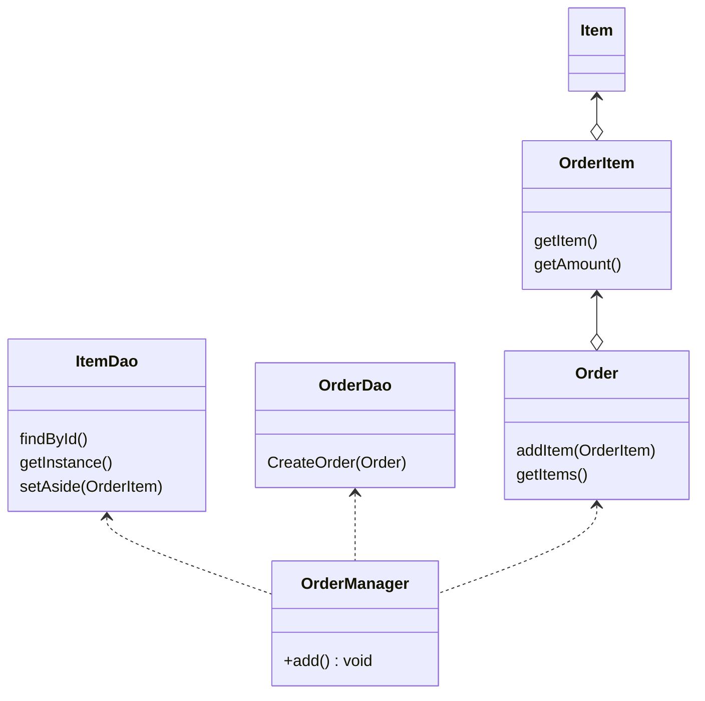

Facadeパターンはクラスやオブジェクト構造に注目したパターンで、複雑に連携し合うクラスやオブジェクトを容易に扱うためのAPIを提供することを目的としています。
> サブシステム内に存在する複数のインターフェースに１つの統一インターフェースを与える。
> facadeパターンはサブシステムの利用を用意にするための高レベルインターフェースを定義する。

### メリット
- サブシステムの構成要素を隠蔽する
- サブシステムとクライアントの結びつきをゆるくする

