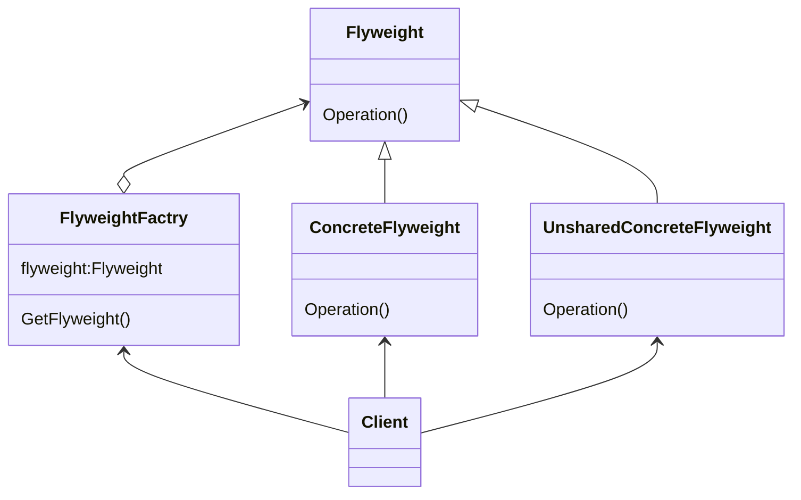

Flyweightパターンは、オブジェクトの構造に注目したパターンで、多くのオブジェクトを効率よく扱うことを目的としています。
> 多数の細かいオブジェクトを効率よくサポートするために共有を利用する

#### メリット
- 生成されるオブジェクトの数を抑える
- リソースの消費を抑える

```mermaid
classDiagram

class FlyweightFactry {
    flyweight:Flyweight
    GetFlyweight()
}

class Flyweight {
    Operation()
}

class ConcreteFlyweight {
    Operation()
}

class UnsharedConcreteFlyweight {
    Operation()
}

FlyweightFactry <-- Client
ConcreteFlyweight <-- Client
UnsharedConcreteFlyweight <-- Client
Flyweight <--o FlyweightFactry
Flyweight <|-- ConcreteFlyweight
Flyweight <|-- UnsharedConcreteFlyweight
```
