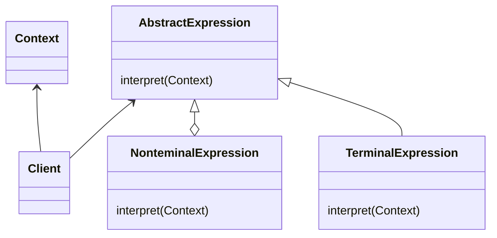

Interpreterパターンはクラスの振る舞いに注目したパターンで、文法を解析し、その結果を利用して処理をおこなうことを目的としています。
> 言語に対して、文法表現と、それを使用して文を解釈するインタプリタインタプリタを一緒に定義する

### メリット
- 規則の追加や変更が簡単

```mermaid
classDiagram
class AbstractExpression {
    interpret(Context)
}

class TerminalExpression {
    interpret(Context)
}

class NonteminalExpression {
    interpret(Context)
}

Context <-- Client
AbstractExpression <-- Client
AbstractExpression <|--o NonteminalExpression
AbstractExpression <|-- TerminalExpression
```