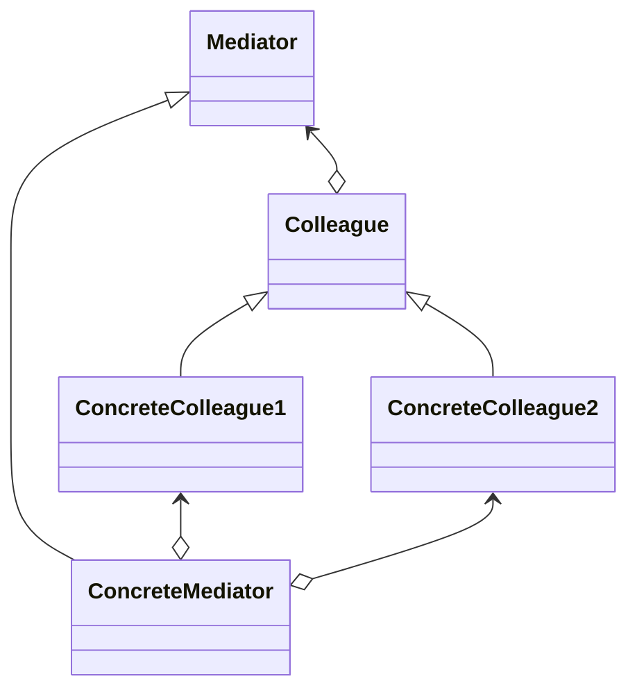

Mediatorパターンはオブジェクトの振る舞いに注目したパターンで、やりとりをおこなうオブジェクトどうしの同志の結びつきを緩めることを目的としています
> オブジェクト群の相互作用をカプセル化するオブジェクトを定義する。
> Mediatorパターンは、オブジェクト同士がお互いを明示的に参照し合うことがないようにして、結合度を低めることを促進する。
> それにより、オブジェクトの相互作用を独立に変えることができるようになる。

### メリット
- クラス同士のやりとりを一極集中する
- Colleagueオブジェクトの結びつきを緩くする

