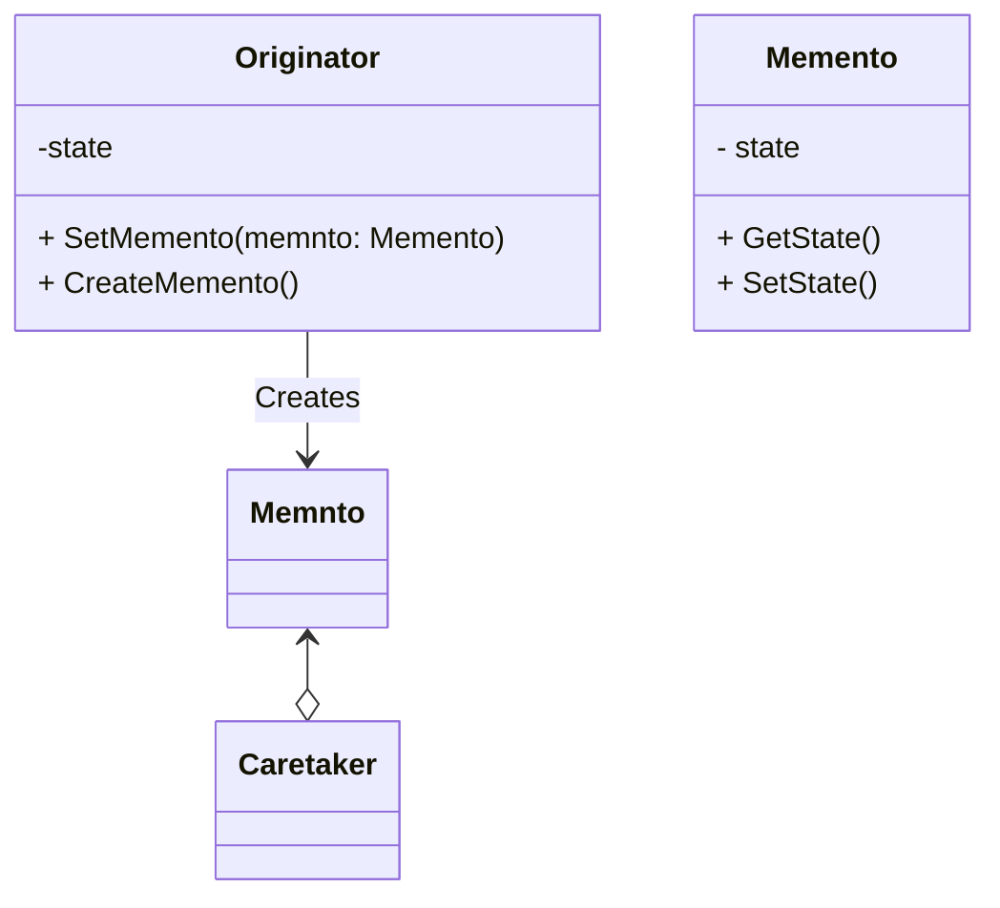

Mementoパターンはオブジェクトの振る舞いに注目したパターンで、オブジェクトのスナップショットを採ることを目的にしています。
> カプセル化を破壊せずに、オブジェクトの内部状態を捉えて外面化しておき、オブジェクトを後にこの状態に戻すことができるようにする。

### メリット
- オブジェクトの状態をある時点に戻することができる
- Originatorクラスを単純なものにする

```mermaid
classDiagram
class Originator {
    -state
    + SetMemento(memnto: Memento)
    + CreateMemento()
}

class Memento {
    - state
    + GetState()
    + SetState()
}

Originator --> Memnto : Creates
Memnto <--o Caretaker
```
