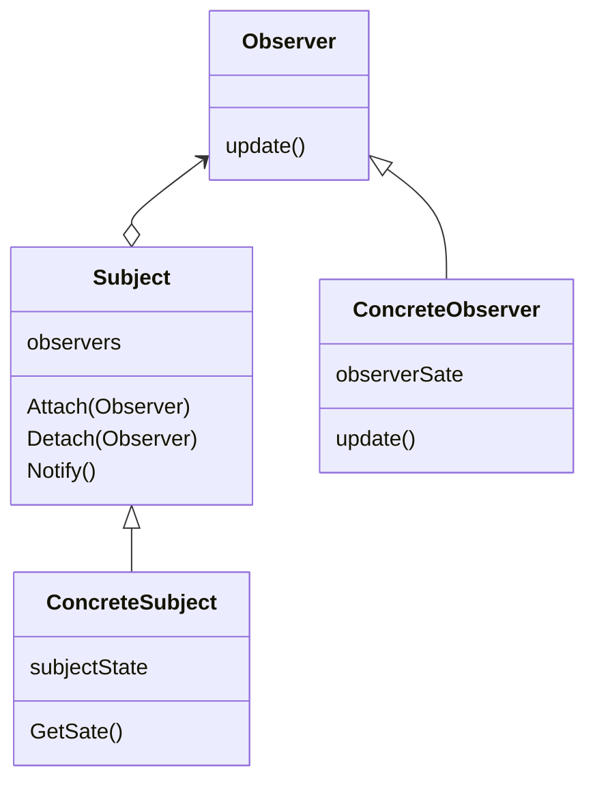

Observerパターンはオブジェクトの振る舞いに注目したパターンで、オブジェクトの変化を他のオブジェクトに通知することを目的としています。
> あるオブジェクトが状態を変えたときに、それに依存する全てのオブジェクトに自動的にそのことが知らされ、また、それらが更新されるように、オブジェクト間に一対多の依存関係を定義する。

### メリット
- ConcreteSubjectクラスとConcreteObserverクラスを独立して拡張できる

