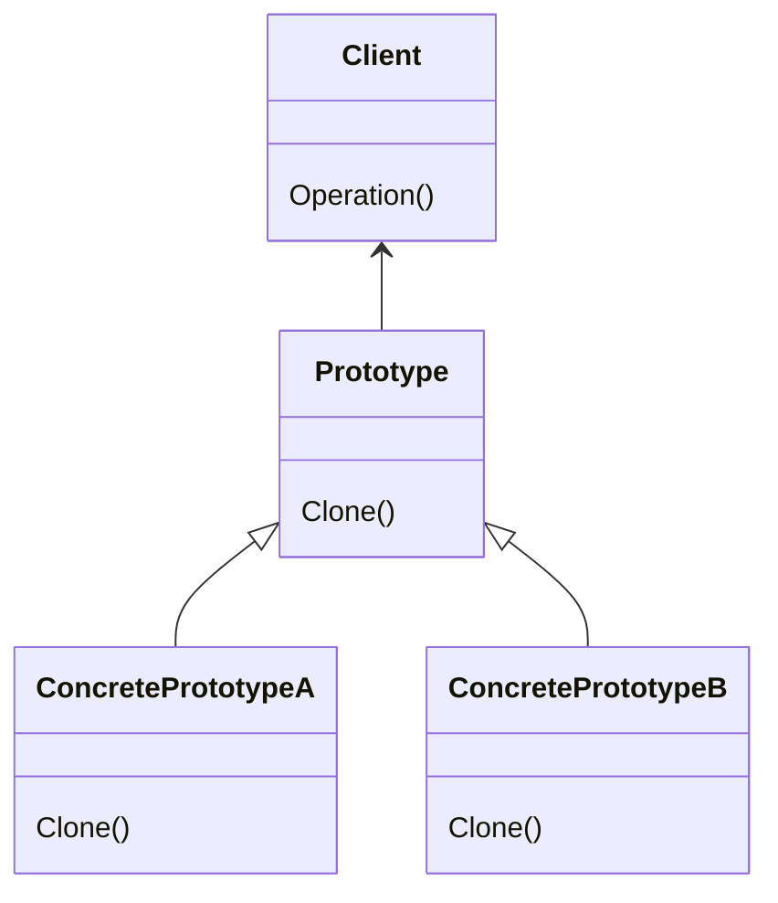

Prototypeパターンはオブジェクトの生成方法に注目したパターンで、オブジェクトをコピーして新しいオブジェクトを生成することを目的としています。
> 精製すべきオブジェクトの種類を原型となるインスタンスを使って明確にし、それをコピーすることで新たなオブジェクトの生成を行う。

### メリット
- オブジェクトの生成処理を隠蔽できる
- クラスからインスタンスの生成が難しい場合に適用できる
- サブクラス化を減らすことができる

