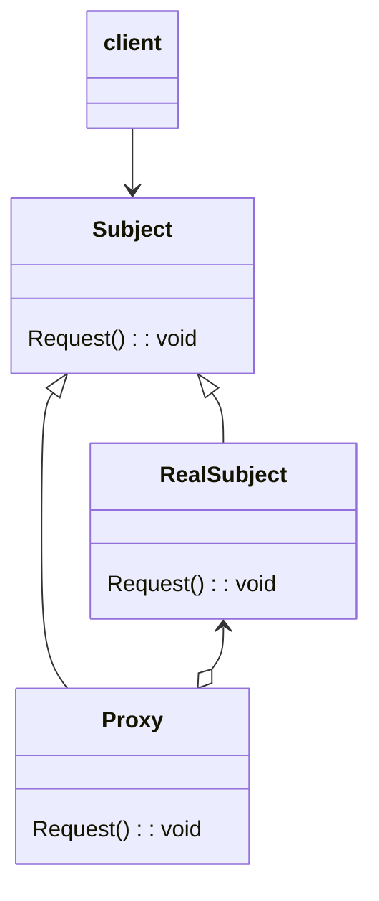

Proxyパターンはオブジェクトの構造に注目したパターンです。Proxyパターンは、オブジェクトとその利用側との間に緩衝剤を用意することで、お互いを分離したり付加的な機能を追加することを目的としています。
> あるオブジェクトへのアクセスを制御するために、そのオブジェクトの代理、またはいれものを提供する

### メリット
- オブジェクトへのアクセスが間接的になる

```mermaid
classDiagram
class Subject {
    Request(): void
}
class RealSubject {
    Request(): void
}
class Proxy {
    Request(): void
}
client --> Subject
Subject <|-- RealSubject
Subject <|-- Proxy
RealSubject <--o Proxy
```