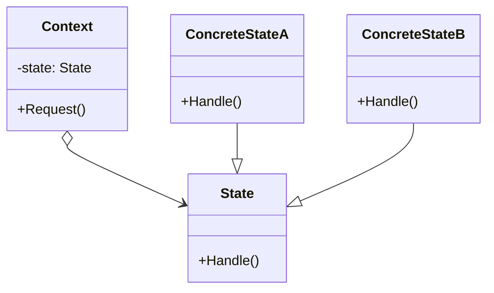

Stateパターンはオブジェクトの振る舞いに注目したパターンで、その名の通り「状態」をクラスとして表すことを目的としています。
> オブジェクトの内部状態が変化したときに、オブジェクトが振る舞いを変えるようにする。クラス内では振る舞いの変化を記述せず、状態を表すオブジェクトを導入することでこれを実現する。

### メリット
- 状態に固有の処理をまとめることができる
- 状態に固有の処理を選択するための条件文がなくなる

