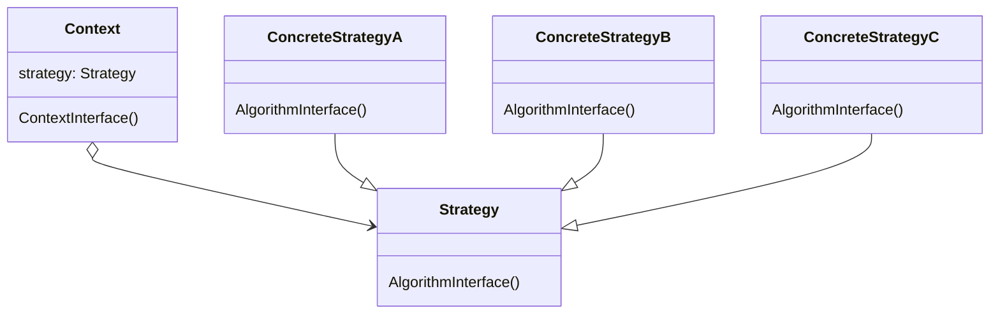

Strategy パターンはオブジェクトの振る舞いに注目したパターンで、アルゴリズムをクラスとして定義し、切り替えられるようにすることを目的としています。
> アルゴリズムの集合を定義し、各アルゴリズムをカプセル化して、それらを交換可能にする。Strategyパターンを利用することで、アルゴリズムを、それを利用するクライアントからは独立に変更することができるようになる。

```mermaid
classDiagram
class Context {
    strategy: Strategy
    ContextInterface()
}
class Strategy {
    AlgorithmInterface()
}
class ConcreteStrategyA {
    AlgorithmInterface()
}
class ConcreteStrategyB {
    AlgorithmInterface()
}
class ConcreteStrategyC {
    AlgorithmInterface()
}
Context o--> Strategy
ConcreteStrategyA --|> Strategy
ConcreteStrategyB --|> Strategy
ConcreteStrategyC --|> Strategy
```
