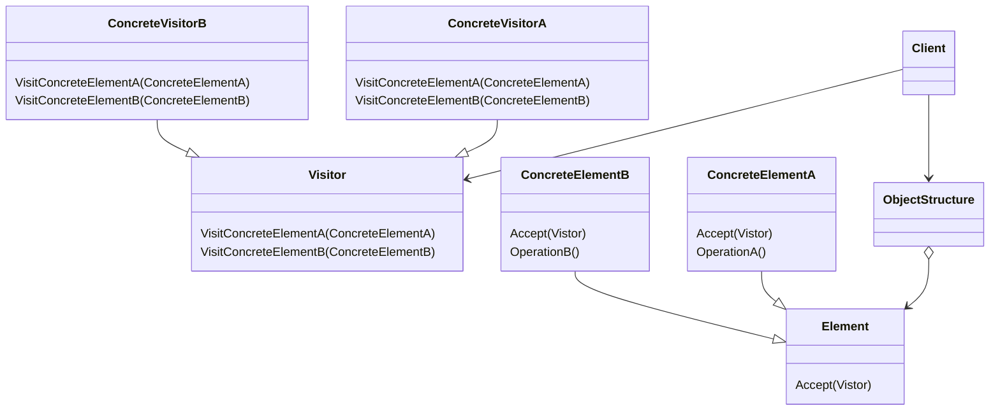

Visitorパターンはオブジェクトの振る舞いに注目したパターンで、データ構造上の要素とそれに対する操作を分離することを目的としています。
> あるオブジェクト構造上の要素で実行されるオペレーションを表現する。
> Visitor パターンにより、オペレーションを加えるオブジェクトのクラスに変更を加えずに、新しいオペレーションを定義することができるようになる。

### メリット
- 共通な操作を局所化する
- 新しい操作を簡単に追加できる

