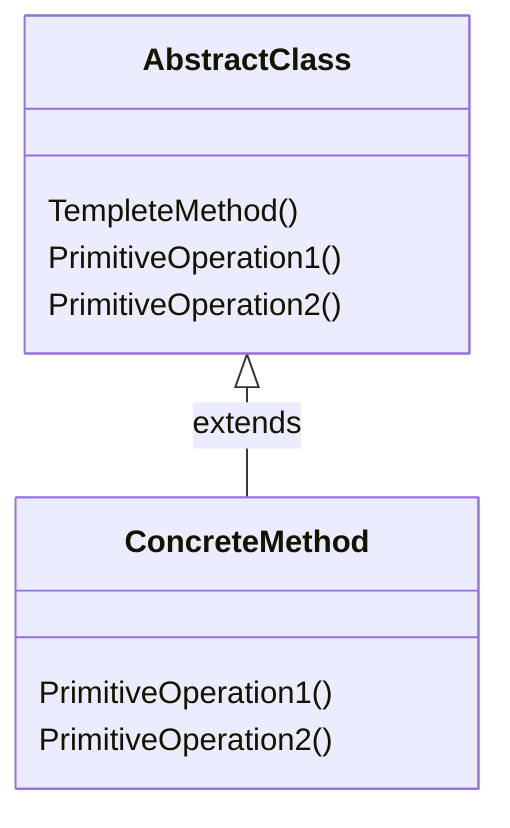

Template Methodパターンはクラスの振る舞いに注目したパターンで、サブクラスで具体的な振る舞いを決定させることを目的としています。
> 1つのオペレーションにアルゴリズムのスケルトンを定義しておき、その中のいくつかのステップについては、サブクラスでの定義に任せることにする。
> Template Methodパターンでは、アルゴリズムの構造を変えずに、アルゴリズム中のあるステップをサブクラスで定義する。

### メリット
- 共通な処理をまとめることができる
- サブクラスにより、具体的な処理内容を帰ることができる

