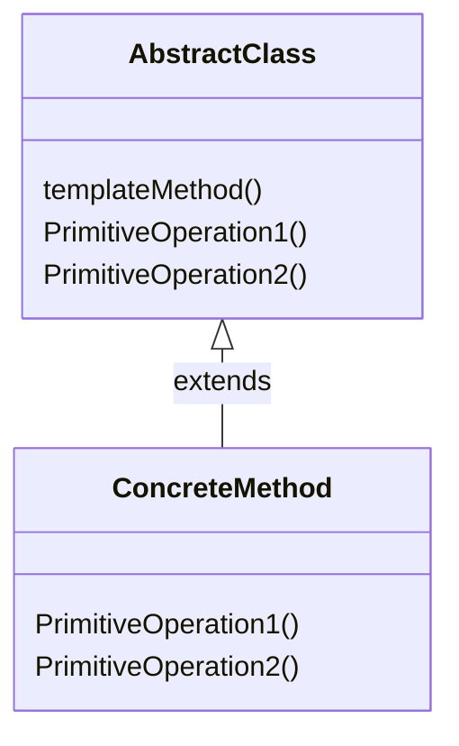

Template Methodパターンはクラスの振る舞いに注目したパターンで、サブクラスで具体的な振る舞いで決定させることを目的としています。
GoF本では、Template Methodパターンの目的は次の様に定義されています。
> １つのオペレーションにアルゴリズムのスケルトンを定義しておき、その中のいくつかのステップについては、サブクラスでの定義に任せることにする。
> Template Methodパターンでは、アルゴリズムの構造を変えずに、アルゴリズム中のあるステップをサブクラスで定義する。

AbstractClass
処理の大きな枠組みを定義するクラス。抽象メソッドのようにサブクラスで実装することが期待されるメソッドの名前を「do~」とすることが多い。

ConcreteClass
AbstractClassを継承したクラス。定義された抽象メソッドを実装し、具体的な処理内容を決定する。

# クラス図

Doc
https://mermaid-js.github.io/mermaid/#/classDiagram